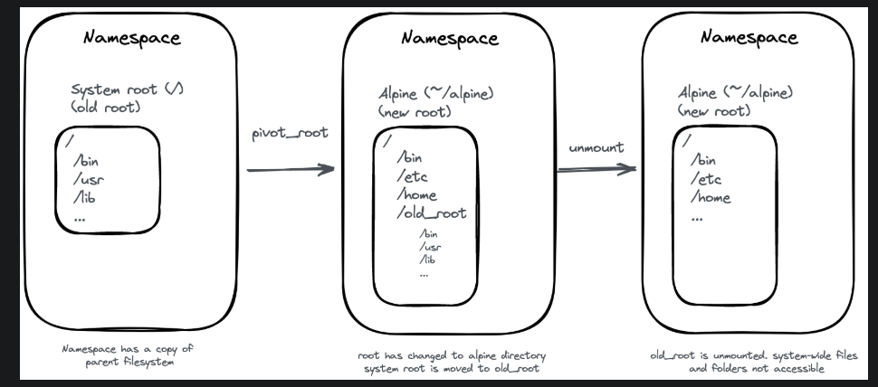
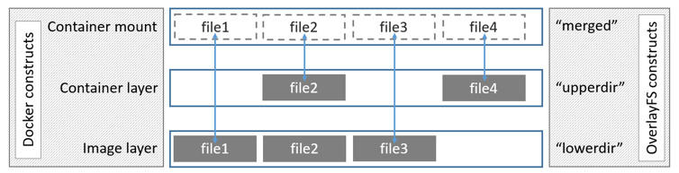

### Namespace

`nsenter` 进入已存在的命名空间（Namespace）并执行命令。
```
root@GreenCloud:~# docker run  -d --rm -it ubuntu 
7949ccebd842b7b3c39c7135ef634c62e028f108ede0598ab2818335d639f448
root@GreenCloud:~# docker inspect -f '{{.State.Pid}}' 7949ccebd842b7b3c39c7135ef634c62e028f108ede0598ab2818335d639f448
478030
root@GreenCloud:~# nsenter -t 478030 --net
root@GreenCloud:~# ip addr
1: lo: <LOOPBACK,UP,LOWER_UP> mtu 65536 qdisc noqueue state UNKNOWN group default qlen 1000
    link/loopback 00:00:00:00:00:00 brd 00:00:00:00:00:00
    inet 127.0.0.1/8 scope host lo
       valid_lft forever preferred_lft forever
    inet6 ::1/128 scope host 
       valid_lft forever preferred_lft forever
12: eth0@if13: <BROADCAST,MULTICAST,UP,LOWER_UP> mtu 1500 qdisc noqueue state UP group default 
    link/ether 02:42:ac:11:00:02 brd ff:ff:ff:ff:ff:ff link-netnsid 0
    inet 172.17.0.2/16 brd 172.17.255.255 scope global eth0
       valid_lft forever preferred_lft forever
```
### Cgroups
在 Linux 中，Cgroups 给用户暴露出来的操作接口是文件系统，即它以文件和目录的方式组织在操作系统的 /sys/fs/cgroup 路径下，可以使用 mount -t cgroup 命令查看 Cgroups v1文件系统。

```
cgroup on /sys/fs/cgroup/systemd type cgroup (rw,nosuid,nodev,noexec,relatime,xattr,name=systemd)
cgroup on /sys/fs/cgroup/cpu,cpuacct type cgroup (rw,nosuid,nodev,noexec,relatime,cpu,cpuacct)
cgroup on /sys/fs/cgroup/freezer type cgroup (rw,nosuid,nodev,noexec,relatime,freezer)
cgroup on /sys/fs/cgroup/cpuset type cgroup (rw,nosuid,nodev,noexec,relatime,cpuset)
cgroup on /sys/fs/cgroup/rdma type cgroup (rw,nosuid,nodev,noexec,relatime,rdma)
cgroup on /sys/fs/cgroup/misc type cgroup (rw,nosuid,nodev,noexec,relatime,misc)
cgroup on /sys/fs/cgroup/memory type cgroup (rw,nosuid,nodev,noexec,relatime,memory)
cgroup on /sys/fs/cgroup/net_cls,net_prio type cgroup (rw,nosuid,nodev,noexec,relatime,net_cls,net_prio)
cgroup on /sys/fs/cgroup/blkio type cgroup (rw,nosuid,nodev,noexec,relatime,blkio)
cgroup on /sys/fs/cgroup/perf_event type cgroup (rw,nosuid,nodev,noexec,relatime,perf_event)
cgroup on /sys/fs/cgroup/hugetlb type cgroup (rw,nosuid,nodev,noexec,relatime,hugetlb)
cgroup on /sys/fs/cgroup/pids type cgroup (rw,nosuid,nodev,noexec,relatime,pids)
cgroup on /sys/fs/cgroup/devices type cgroup (rw,nosuid,nodev,noexec,relatime,devices)

```
`sys/fs/cgroup`下面的pids,cpu,perf_event也是子系统。


```
ls /sys/fs/cgroup/cpu
cgroup.clone_children  cgroup.sane_behavior  cpuacct.usage      cpuacct.usage_percpu      cpuacct.usage_percpu_user  cpuacct.usage_user  cpu.cfs_period_us  cpu.idle    cpu.stat    notify_on_release  system.slice  user.slice
cgroup.procs           cpuacct.stat          cpuacct.usage_all  cpuacct.usage_percpu_sys  cpuacct.usage_sys          cpu.cfs_burst_us    cpu.cfs_quota_us   cpu.shares  init.scope  release_agent      tasks
```
release_agent 是容器逃逸中一个经典的利用点，通常配合 cgroup v1 的 notify_on_release 和 release_agent 实现逃逸。在 cgroup v2 中，release_agent 和 notify_on_release 文件被移除，取而代之的是 cgroup.events 文件。

` sudo docker run -it  --cpu-quota=2000 ubuntu /bin/bash` 在启动docker时传入cpu-quota参数，来限制容器的CPU资源。容器最多可以使用 2% 的 CPU 时间

```
hids@ubuntu:~$ ls /sys/fs/cgroup/cpu/
cgroup.clone_children  cgroup.sane_behavior  cpuacct.usage      cpuacct.usage_percpu      cpuacct.usage_percpu_user  cpuacct.usage_user  cpu.cfs_period_us  cpu.idle    cpu.stat  init.scope         release_agent  tasks
cgroup.procs           cpuacct.stat          cpuacct.usage_all  cpuacct.usage_percpu_sys  cpuacct.usage_sys          cpu.cfs_burst_us    cpu.cfs_quota_us   cpu.shares  docker    notify_on_release  system.slice   user.slice
hids@ubuntu:~$ ls /sys/fs/cgroup/cpu/docker/
0356f9f6837987ad86dd3e795426cff41d89dbf45a3496e9f012a6a4640d1219  cpuacct.stat       cpuacct.usage_percpu       cpuacct.usage_sys   cpu.cfs_period_us  cpu.shares      cpu.uclamp.min
cgroup.clone_children                                             cpuacct.usage      cpuacct.usage_percpu_sys   cpuacct.usage_user  cpu.cfs_quota_us   cpu.stat        notify_on_release
cgroup.procs                                                      cpuacct.usage_all  cpuacct.usage_percpu_user  cpu.cfs_burst_us    cpu.idle           cpu.uclamp.max  tasks
hids@ubuntu:~$ ls /sys/fs/cgroup/cpu/docker/0356f9f6837987ad86dd3e795426cff41d89dbf45a3496e9f012a6a4640d1219/
cgroup.clone_children  cpuacct.stat   cpuacct.usage_all     cpuacct.usage_percpu_sys   cpuacct.usage_sys   cpu.cfs_burst_us   cpu.cfs_quota_us  cpu.shares  cpu.uclamp.max  notify_on_release
cgroup.procs           cpuacct.usage  cpuacct.usage_percpu  cpuacct.usage_percpu_user  cpuacct.usage_user  cpu.cfs_period_us  cpu.idle          cpu.stat    cpu.uclamp.min  tasks
hids@ubuntu:~$ cat  /sys/fs/cgroup/cpu/docker/0356f9f6837987ad86dd3e795426cff41d89dbf45a3496e9f012a6a4640d1219/cpu.cfs_quota_us 
2000

cat  /sys/fs/cgroup/cpu/docker/0356f9f6837987ad86dd3e795426cff41d89dbf45a3496e9f012a6a4640d1219/tasks 
96507
```
`tasks`文件中包含容器进程的pid信息
### pivot+unshare

```
# 创建了一个路径
$ mkdir pivot 
# 并在这个路径下挂载了大小为1G, 类型为 tmpfs 的临时文件系统.
$ mount -n -t tmpfs -o size=1G none pivot

# 进入这个临时文件系统, 并制造一个地方用于挂载之前的rootfs
$ cd pivot && mkdir old-rootfs
# 开始切换rootfs, 现在令pivot成为新的rootfs, 并将之前的挂载都挂到old下
$ unshare -m && pivot_root . old-rootfs

# 看看我们现在在哪儿
$ pwd
/root/pivot

$ cd . && pwd
/
$ ls && mount && ps
-bash: ls:    command not found
-bash: mount: command not found
-bash: ps:    command not found
```
这是sudo su 直接进入/root/pivot，而且在这个下cd .. && pwd 结果依然是/
上述就是利用两个系统调用做的进程视图的隔离

```
# 准备bin文件夹, 我们到时候需要用这个文件夹里的ls工具
$ cd pivot && mkdir bin
$ cp /bin/ls ./bin

# ls工具依赖一些库, 然后我们也搞来这些库
$ ldd /bin/ls
        linux-vdso.so.1 =>  (0x00007ffe79396000)
        libselinux.so.1 => /lib/x86_64-linux-gnu/libselinux.so.1 (0x00007f4382997000)
        libc.so.6 => /lib/x86_64-linux-gnu/libc.so.6 (0x00007f43825cd000)
        libpcre.so.3 => /lib/x86_64-linux-gnu/libpcre.so.3 (0x00007f438235d000)
        libdl.so.2 => /lib/x86_64-linux-gnu/libdl.so.2 (0x00007f4382158000)
        /lib64/ld-linux-x86-64.so.2 (0x00005644db278000)
        libpthread.so.0 => /lib/x86_64-linux-gnu/libpthread.so.0 (0x00007f4381f3b000)
$ mkdir lib lib64
$ cp /lib/x86_64-linux-gnu/<xxx> ./lib
$ cp /lib64/ld-linux-x86-64.so.2 ./lib64

# 好! 再来一次! 结界! 启用!
$ unshare -m && 
  pivot_root . old-rootfs/ && 
  cd . && pwd
/
# 可以了这一回! 
$ ls
bin  lib  lib64  old-rootfs
```
上述这些工具, 由底层存储驱动 aufs / dm / overlay 联合多层镜像最后一起提供，给一个空白的隔离环境提供一些工具
下面是加上了unmount操作，但是下面的没有用unshare,用了就是第一个是ns1,第二和第三个是ns2



一般而言，容器底层使用clone(),unshare()来创建新的命名空间，setns()加入已经存在的命名空间
chroot 和 pivot_root 都是 Linux 中用于更改进程根文件系统的工具，但是具体细节和用法有所不同。

| 特性 | chroot | pivot_root | 
| --- | --- | --- | 
| 功能 | 更改根目录的路径解析，将指定目录作为新的根目录 | 完全切换根文件系统，并隔离旧根，可将旧根目录移至其他位置 | 
| 隔离程度| 较弱，旧根仍可通过某些方式访问（如通过挂载点或特权进程） | 较强，旧根可被隔离或卸载，隔离效果更好 | 
| 挂载点隔离 | 不处理挂载点，需手动管理，无法隔离挂载点 | 支持挂载点隔离，适合与 Mount Namespace 结合使用，可隔离挂载点 | 
| 复杂度| 简单，易于使用，适合快速隔离 | 更复杂，需要正确配置，涉及多个步骤（如设置新的挂载点、移动旧根等） | 
| 逃逸风险 | 较高（特权进程可能通过某些方式逃逸） | 较低（结合 Namespace 使用时更安全） | 
| 容器适用性 | 早期容器使用，现代容器中较少使用，因为隔离性不足 | 现代容器标准做法，结合 Namespace 提供更好的隔离性 | 
| 系统调用 | 使用 `chroot()` 系统调用或命令| 使用`pivot_root()`系统调用或命令，例如  | 

其中 Mount Namespace 修改的，是容器进程对文件系统“挂载点”的认知。只有在“挂载”这个操作发生之后，进程的视图才会被改变。而在此之前，新创建的容器会直接继承宿主机的各个挂载点。上述的chroot()或者pivot_root()就是负责修改挂载点的。

在容器进程启动之前重新挂载它的整个根目录"/"。而由于 Mount Namespace 的存在，这个挂载对宿主机不可见，所以容器进程就可以在里面祟随便修改自己的文件而不会影响到宿主机。

### rootfs

rootfs租借内核和其他容器共享。rootfs包含了很类似操作系统的根目录的结构，里面包含了所有的文件和目录，以及一些必要的文件和目录。这也导致他的依赖是被封装到一起的。

当然可以，下面是给小白的通俗讲解版本：

---

### 🐳 Docker 镜像和容器的“分层汉堡包”理解法

我们可以把 Docker 的镜像和容器想象成一个**汉堡包**🍔，一层一层地叠起来，每一层都有它的作用。

---

#### 一、镜像是“静态的多层汉堡”

- **镜像（Image）** 是我们用来创建容器的“食材包”，里面是静态的文件，不会变化。
- 镜像不是一整块东西，而是**一层一层的叠加而成**的（就像汉堡里的面包、生菜、肉饼、酱料）。类似预制好的菜品。

> 每一步构建镜像的命令（比如安装软件、复制文件）都会新增一层。

---

#### 二、容器是“动态的汉堡”

容器是运行中的镜像，它不光吃食材包，还得“能动”，所以它比镜像多了两层：

- **只读层（镜像层）**：就是之前那个静态汉堡的底层部分，只能看，不能改。
- **init 层**：装一些启动时需要的小修改，比如 `/etc/hosts`、`/etc/resolv.conf`，这层专门隔离，不会被提交。
- **读写层**：你运行容器过程中创建的文件、修改的配置、写入的数据，全都放在这一层。

---

#### 三、为啥要分层？省空间 + 更快！

想象一下你要做 100 个汉堡：

- 用一样的面包、生菜、肉饼，只改一层酱料。
- 那就不用每次都做一整套，改一层就行！超级省事！

这就是 Docker 引入“分层”的好处：**复用已有的层，节省空间和时间**。

---

#### 四、这些层是怎么组合在一起的？靠 UnionFS！

Docker 用一种叫 **UnionFS（联合文件系统）** 的技术，把这些层“叠”在一起，看起来就像一个完整的文件系统。正式有了unionfs才提供那个了统一的视图，看起来好像整个系统只有一层一样，实际上下面包含了很多层。

OverlayFS（最常用）：
- 使用 lowerdir（只读层）、upperdir（可写层）和 workdir（工作目录）组合成一个统一的挂载点。
- 文件查找从上到下（优先级：可写层 > 顶层只读层 > ... > 基础层）。
- 删除文件时，在可写层标记为“白出”（whiteout），隐藏底层文件


比如：

```text
┌──────────────┐
│ 读写层（可改）│ ← 你运行容器时写入的数据
├──────────────┤
│ Init 层       │ ← 启动容器时的初始化配置
├──────────────┤
│ 镜像层（只读） │ ← 从镜像继承来的文件
└──────────────┘
```


你看到的是一个完整的系统，但其实是“拼”出来的。

---

#### 五、删除文件怎么操作？靠“遮住它”！

镜像层是只读的，不能真的删文件。那怎么“删”呢？

举个例子：

- 假如你想删掉镜像层里的 `foo.txt`。
- Docker 会在读写层创建一个叫 `.wh.foo.txt` 的文件（whiteout 文件）。
- 这样就像给原文件蒙了一块布，看不见它，它就“相当于被删掉了”。
从更高的层次进行遮挡。

---

#### 总结一句话：

> **Docker 容器就像一个汉堡包，每一层都有不同作用，组合起来就是完整的操作系统。**
